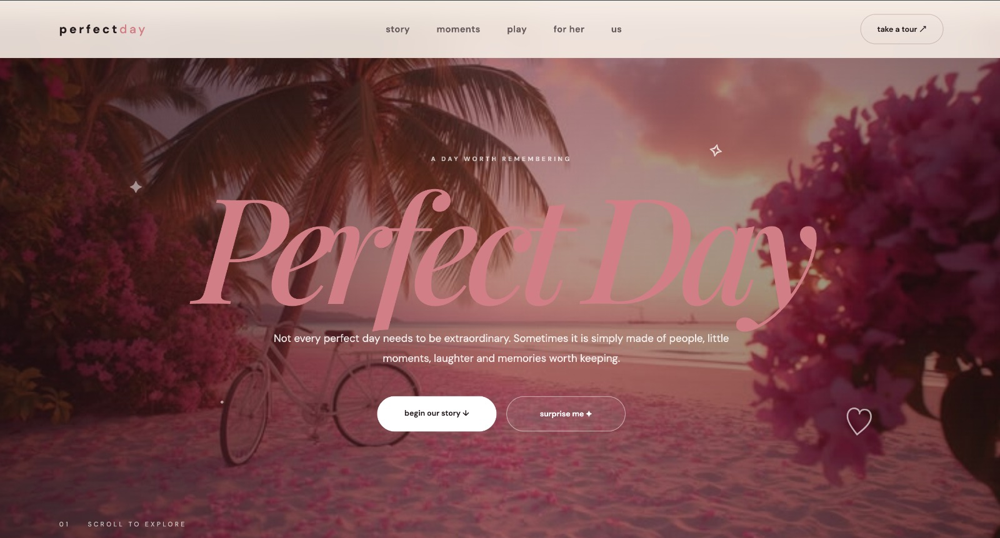

# The Perfect Day

## 🌐 Website Preview

A little digital world made from friendship, laughter, creativity, and all the moments worth remembering.

## ✨ About The Project

**The Perfect Day** is a creative interactive website built with HTML, CSS, and JavaScript.

It brings together memories, games, little surprises, motivational thoughts, and moments from a special day into one digital experience.

## 💫 Features

- 🌸 Interactive "Perfect Day" experience
- 🎀 Smooth navigation between sections
- ✨ Surprise interaction
- 🎮 Interactive Tic-Tac-Toe
- 💭 Motivational quotes
- ✅ Interactive daily checklist
- 💌 "Leave a little light" message section
- 🎁 Interactive gift ending
- ❤️ Animated hearts
- 📸 Personal memories and photographs
- 💻 Responsive design

## 🛠️ Built With

- HTML5
- CSS3
- JavaScript
- Google Fonts

## 👩🏻‍💻 Made By

**Shivangi & Tanisha**

Made with creativity, friendship and lots of love. ♡

## 🌐 Live Website

[Visit The Perfect Day ↗](https://tanisha-pie.github.io/the-perfect-day/)
